

# 꼬박꼬박 - Korean Dictionary and Flashcards

This repository is the front end for a dictionary application that can be used to generate flashcards in programs such as Anki.

This project is currently under development, and I am working to improve it whenever I have time. Feel free to contact me about bugs or improvements you think could be made.

## Demo

The application is live [here](https://korean-dictionary.vercel.app/).

## Detailed Description

This is a Next.js project. There is currently no back end being used, but I may create one if I need to integrate data from multiple sources. For now, all calls to APIs and databases are being handled by Next.js with sever actions and API endpoints.

You can look up Korean words and see definitions in 11 different languages, but the API being used only allows you to search for words in Korean. If your interested in trying it out but don't know Korean, I will include some words at the bottom you can copy and paste into the searchbar.

Once users make an account, they will be able to add words to collections which can be viewed on their profile page. If they navigate to the collection, they will see a link to download definitions and example sentences for each word as a CSV file. This file can be directly imported into Anki and will generate a flashcard for each word. The information in this file includes html tags, so be sure to toggle the option for html when importing the file. This will ensure that the word is bold in the example sentences.

All data is from an open API provided by the [National Institute of Korean Language](https://krdict.korean.go.kr/openApi/openApiInfo)

### Spaced Repetition Flashcards

The flashcards in this application rely on an implementation of the [SM-2](https://www.supermemo.com/en/blog/application-of-a-computer-to-improve-the-results-obtained-in-working-with-the-supermemo-method) spaced repetition algorithm similar to the spaced repetition algorithm used in applications like Anki to determine which flashcards users will see.

When users have completed their flashcards for the day, they are given the option to increase the number of cards for the day if they wish to continue studying.

A new study session will begin the following day at 3 a.m. in the user's timezone. No date management package is being used for these calculations. The Intl API is used to send the user's timezone from the front end (this is not perfect, but supported by over 95% of browsers). If the user cannot provide their local timezone, a new study session will start 24 hours after the previous study session was started.

### Translation, AI Sentence Parsing, and AI Chatbot

On the translation page, you can submit sentences and have them translated for you. This is powered by Google Translate (mainly for cost reasons). Below the translation, external links are shown for Google Translate and Papago.

When a user translates a sentence, they will be shown a Parse Sentence button. Sentence parsing is done through Retrieval Augmented Generation (RAG) using LangChain and OpenAI's Chat GPT. This is a slow process and the results are not always perfect. In the future, I may try to optimize the speed of this process by using an external package to analyze the sentence and then rely on the RAG technique to generate links and provide additional information. I may also supply more data to Chat GPT, especially about grammar, to improve accuracy. Currently, Chat GPT is being fed information on parts of speech, the sentence in Korean, and the English translation for the sentence. It breaks down sentences into individual words and grammar structures and indentifies the meaning and part of speech of each part. It also generates links to the application itself or Google in the case of non-Korean words for users to find more information. It returns all of this data as JSON.

Below the translation and sentence parsing section is an AI chatbot that also uses LangChain and OpenAI.

It has been prompted to answer questions pertaining to the Korean language and can answer questions about the sentence the user submitted for translation (it is given both the original sentence and the translation). If a user asks about specific words (and, in many cases, grammatical forms), the chatbot should give the user a link to the search page for that term on this website.

### Making target words bold

The API does not provide information for which word in an example sentence should be bold, something which can be difficult due to the complex conjugation possible in Korean. The dictionary does, however, provide the part of speech and origin for words, which I have used to display the target word in bold. This seems accurate, but I'm sure it is far from perfect. I will continue trying to improve any errors I see with this. I have not extended it to cover terms classed as "품사 없음(어근, 줄어든 말 등)" (Part of speech not applicable (a root, an abbreviated word, etc.)) as there are a range of different parts of speech in this group, and I have not been able to figure out if they can be differentiated by API data alone. I may keep this current system going forward or create a back end and use an open-source package such as [OKT](https://github.com/open-korean-text/open-korean-text) for stemming (어근화).

### Rendering Optimization

Most of the routes in this project lead to pages that would not make sense to build as static SSG pages in NextJS, such as those that display API data for thousands of terms or user data stored in the DB (While this would be fine for its current user base of only me, this would not make sense for an app with a large user base). However, the blog page was made primarily to experiment with SSG since there are a limited number of posts that will be posted. The data for these blog posts are stored on MongoDB like all of the user data, and the pages for these posts are all static HTML pages that are generated at build time using the generateStaticParams function provided by NextJS.

### Known issues

#### Dialog sentences

Target words can have different types of examples. Among these are dialog sentences between two parties (beginning with 가 or 나). I have yet to find any API data denoting the order that these should be put in. Sentences ending with question marks are, to my knowledge, always the first sentence, but I have not investigated this thoroughly. Currently they are displayed in the order recieved from the API. In many cases, this appears to be correct; however, I have found some cases where they are misordered. I hope to find a more accurate solution for ordering these in the near future.

## Overview

- TypeScript
- Next.js
- SWR (for client side data fetching)
- NextAuth.js
- CSS modules

## Example Korean Words

You can copy and paste the following terms into the search bar to see how this app works.

- 쫄깃쫄깃
- 밝다
- 경감하다
- 답답하다
- 하다 (this will give you more than 700 pages of results)

## Screenshots

#### Homepage Search

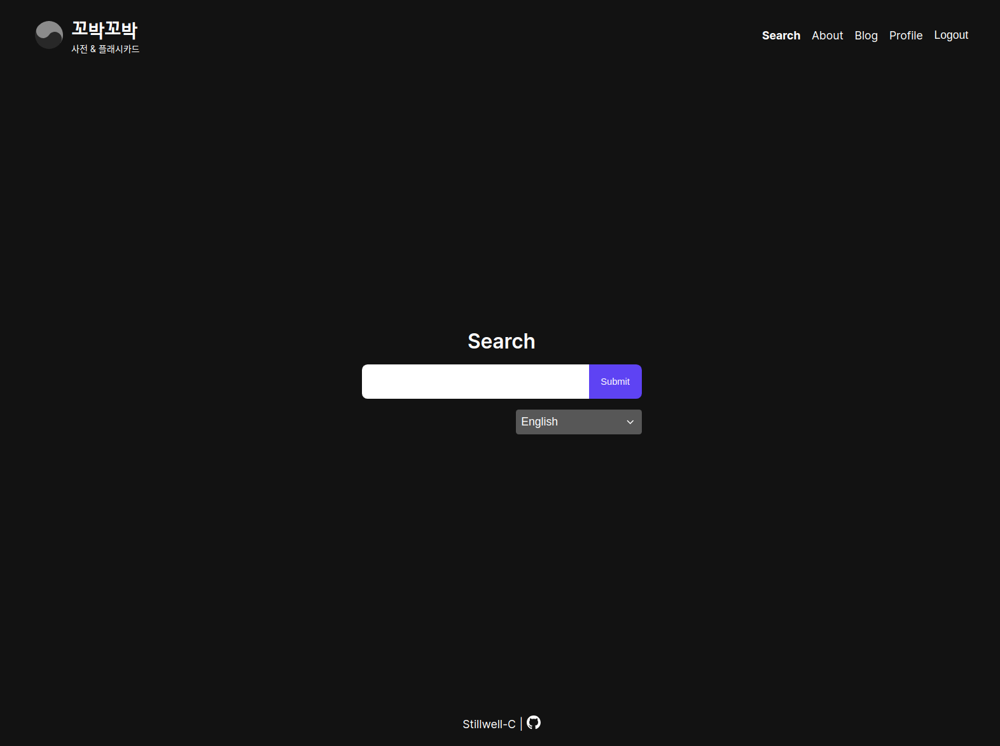

#### Search Results

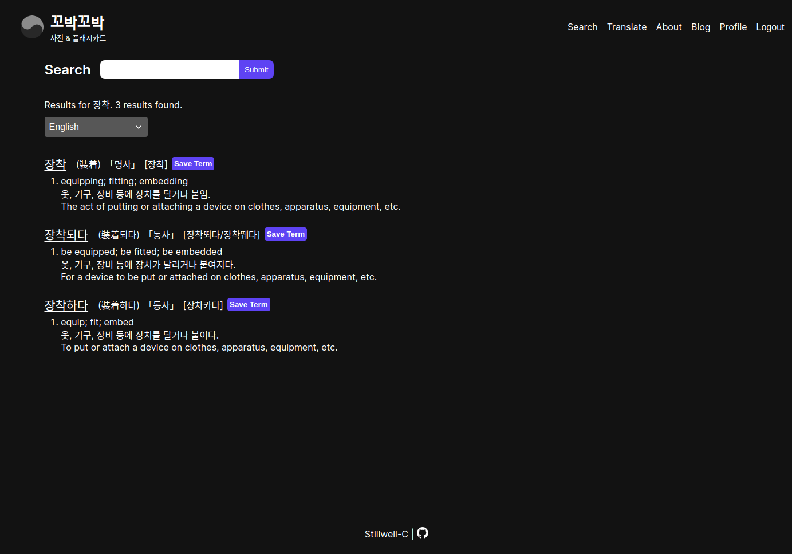

#### Add To Collection Modal

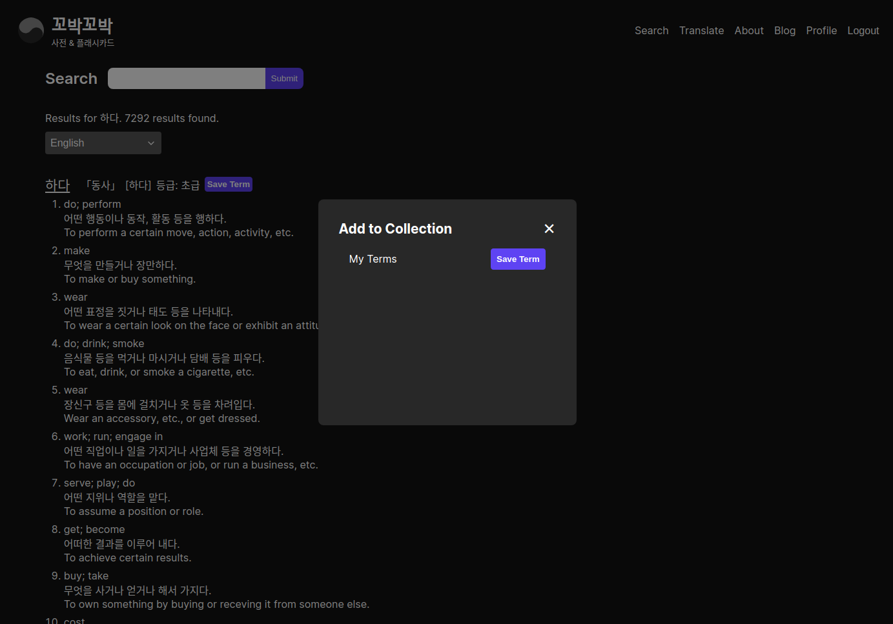

#### Term Page

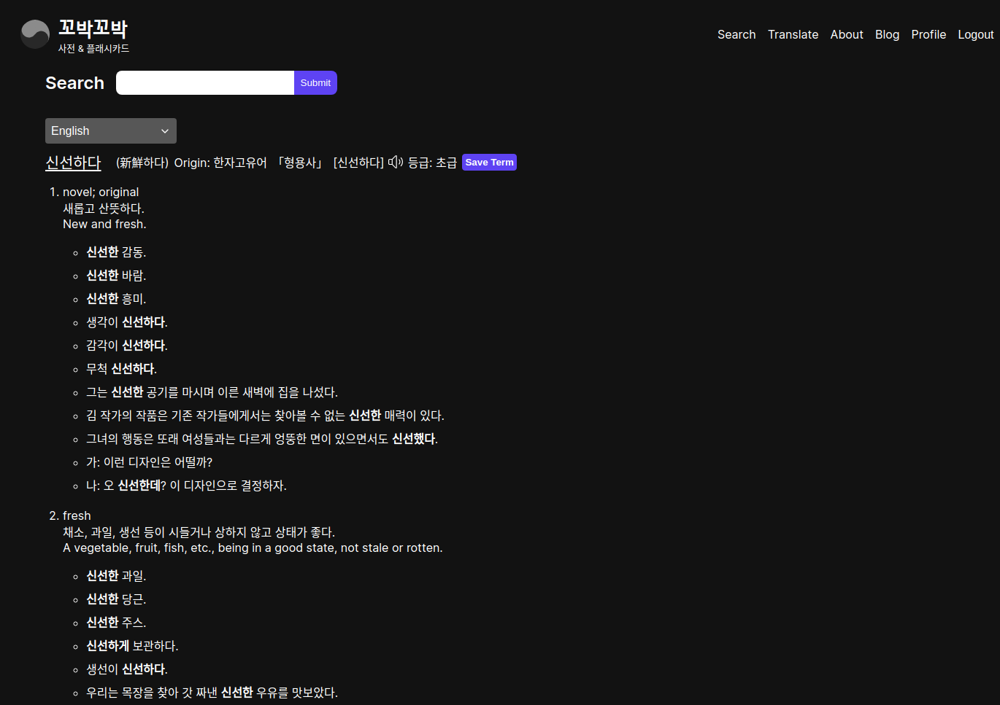

#### Language Toggle

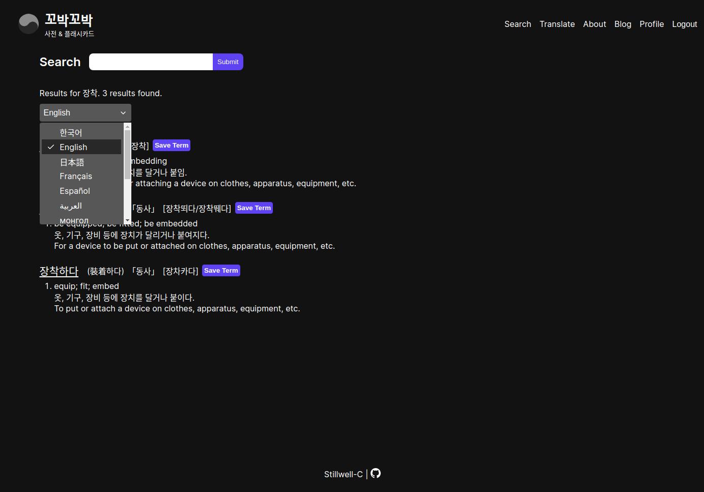

#### Translation & AI Chat Page

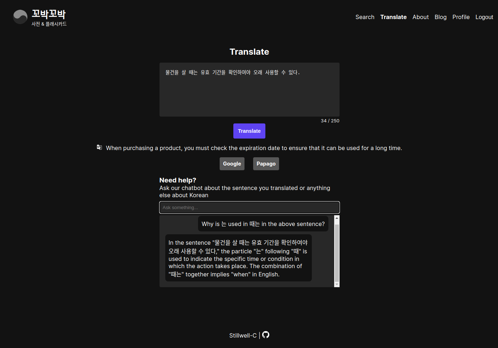

#### Sentence Parsing

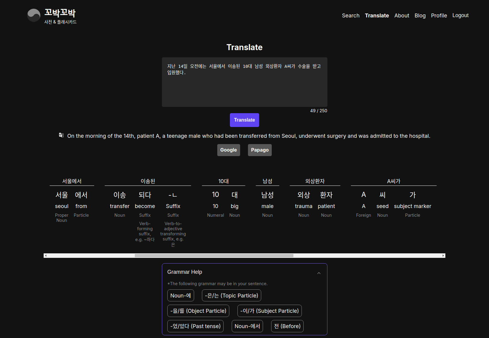

#### Blog Page

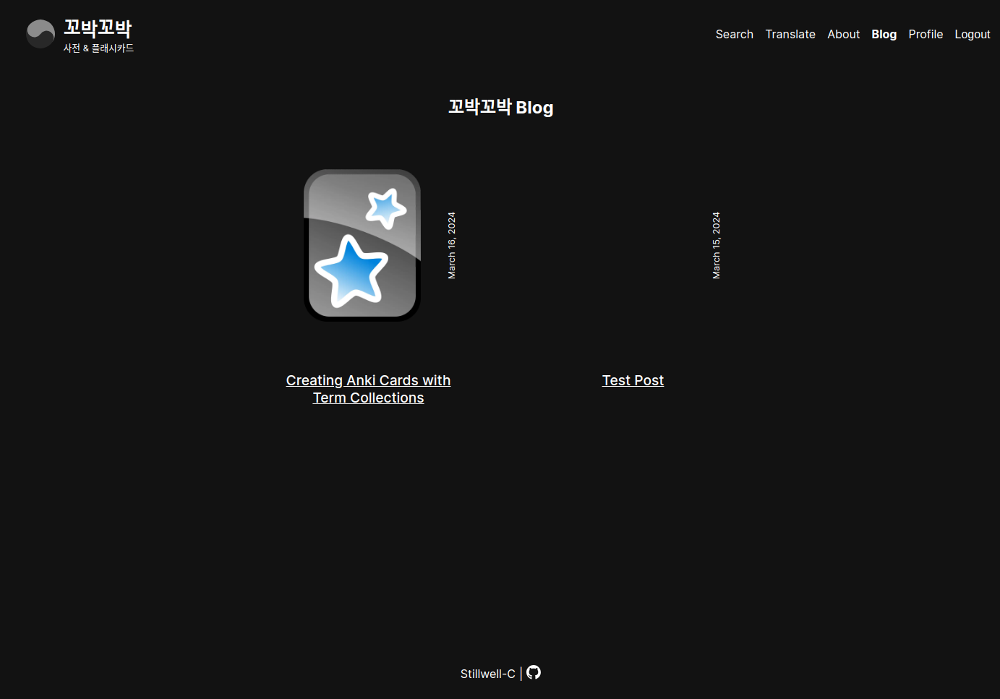

#### Profile Page With User Term Collections

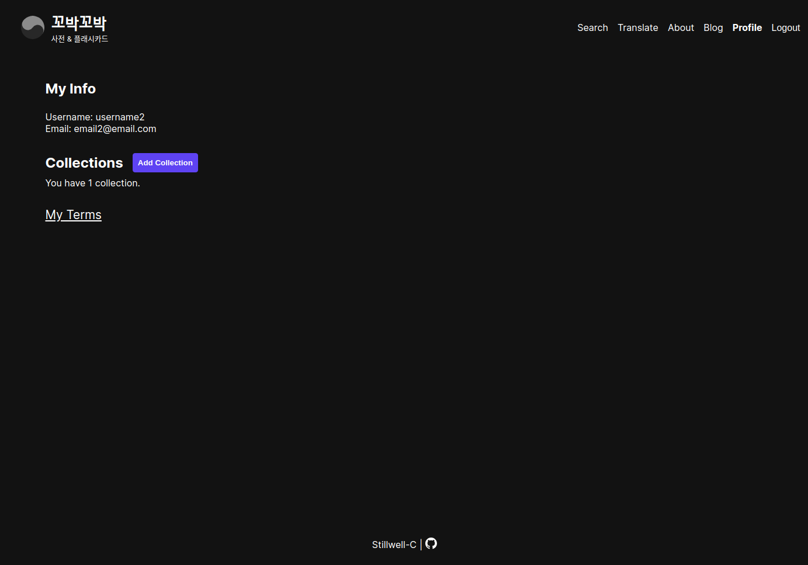

#### Term Collection Page

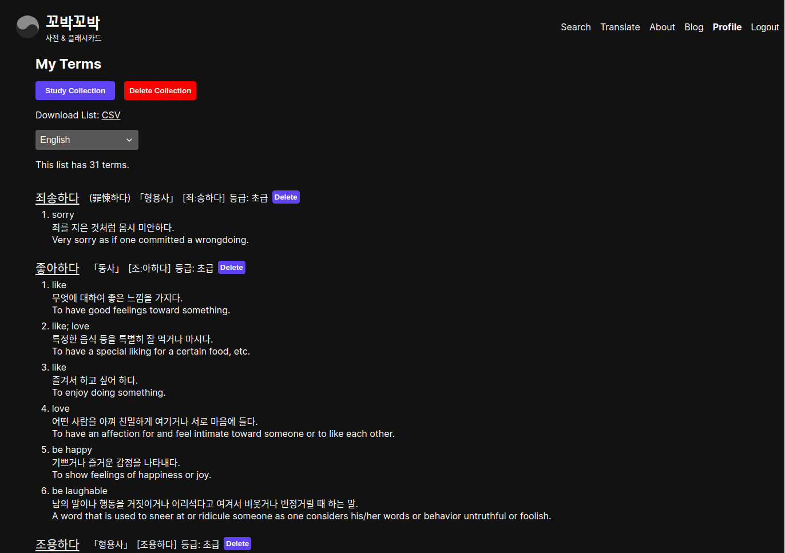

#### Flashcard Front

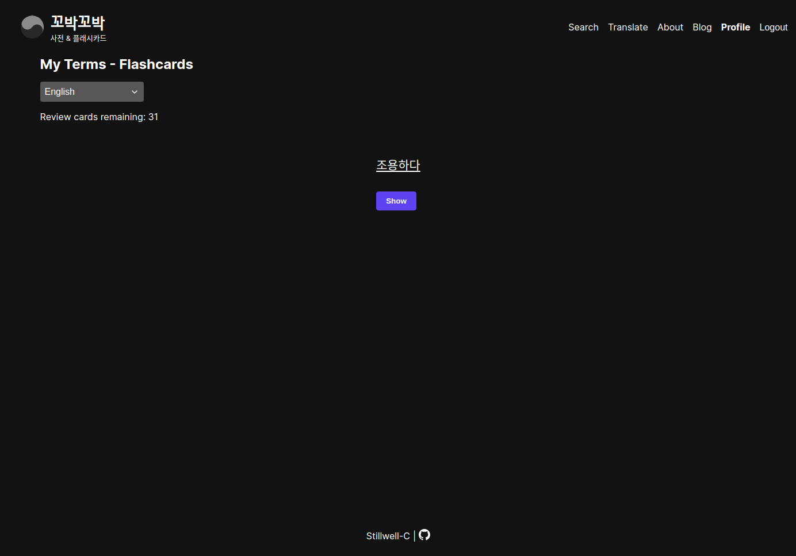

#### Flashcard Back With Spaced Repetition Options

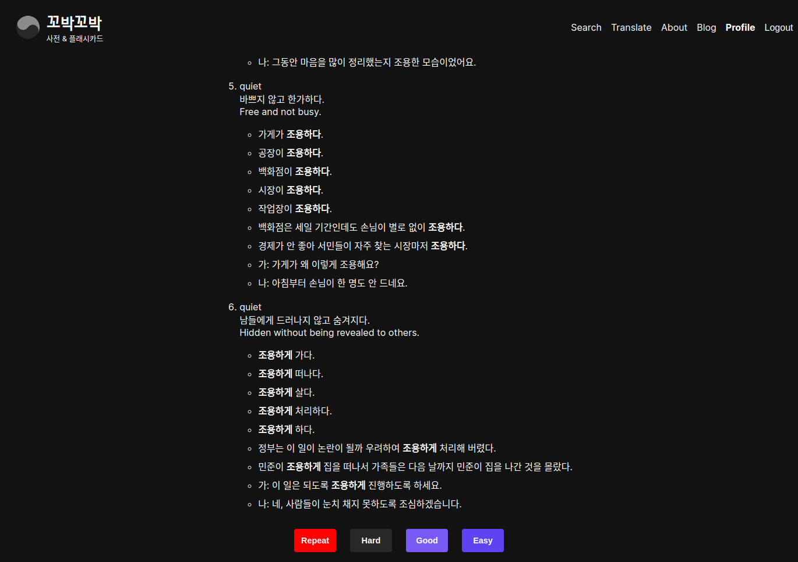
